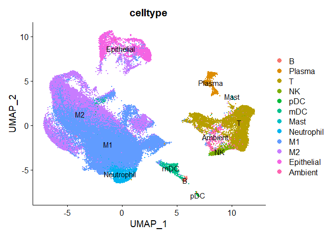
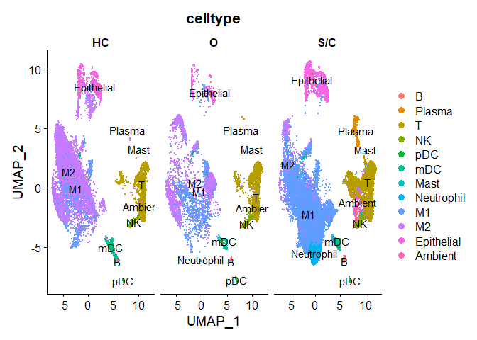
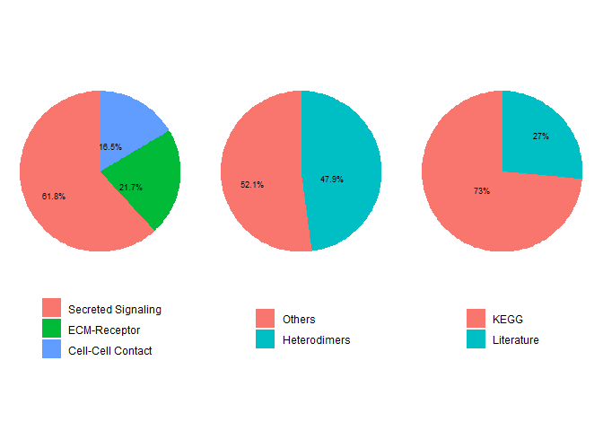
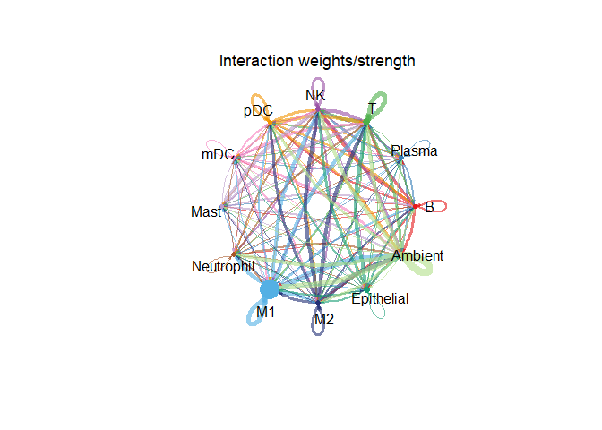

CellChat
================
2022-07-04

### **Library CellChat**

``` r
library(devtools)
library(Seurat)
library(scater)
library(harmony)
library(DropletUtils)
library(scran)
library(CellChat)
library(ggplot2)
library(patchwork)
library(igraph)
library(ComplexHeatmap)
```

### **Load the data**

``` r
lung_seurat <- readRDS('./kogo2022/CellChat/lung_seurat.rds')
lung_seurat
```

    ## An object of class Seurat 
    ## 25916 features across 66452 samples within 2 assays 
    ## Active assay: RNA (23916 features, 2000 variable features)
    ##  1 other assay present: integrated
    ##  3 dimensional reductions calculated: pca, tsne, umap

``` r
UMAPPlot(lung_seurat, group.by = 'celltype', label = TRUE)
```

<!-- -->

``` r
UMAPPlot(lung_seurat, group.by = 'celltype', split.by = 'group', label = TRUE)
```

<!-- -->

### **Preparing the data for CellChat**

``` r
CellChatDB <- CellChatDB.human
showDatabaseCategory(CellChatDB)
```

<!-- -->

``` r
expr <- lung_seurat@assays$RNA@data
meta <- lung_seurat@meta.data
```

### **Run CellChat**

1.  Create CellChat object

``` r
table(lung_seurat$disease)
```

    ## 
    ##     N     Y 
    ## 21939 44513

``` r
covid <- rownames(meta)[meta$group == 'S/C']
covid_input = expr[, covid]
covid_meta = meta[covid, ]
unique(covid_meta$celltype)
```

    ##  [1] M1         Neutrophil Ambient    T          Epithelial NK        
    ##  [7] Plasma     M2         mDC        B          pDC        Mast      
    ## Levels: B Plasma T NK pDC mDC Mast Neutrophil M1 M2 Epithelial Ambient

``` r
cellchat_covid <- createCellChat(object = covid_input, meta = covid_meta, group.by = 'celltype')
```

    ## The cell groups used for CellChat analysis are  B Plasma T NK pDC mDC Mast Neutrophil M1 M2 Epithelial Ambient

``` r
cellchat_covid <- addMeta(cellchat_covid, meta = covid_meta)
cellchat_covid <- setIdent(cellchat_covid, ident.use = 'celltype')

levels(cellchat_covid@meta$celltype)
```

    ##  [1] "B"          "Plasma"     "T"          "NK"         "pDC"       
    ##  [6] "mDC"        "Mast"       "Neutrophil" "M1"         "M2"        
    ## [11] "Epithelial" "Ambient"

``` r
groupSize_covid <- as.numeric(table(cellchat_covid@idents))
cellchat_covid@DB <- CellChatDB
```

2.  Run CellChat

``` r
# Preprocessing the expression data for cell-cell communication analysis
cellchat_covid <- subsetData(cellchat_covid)
cellchat_covid <- identifyOverExpressedGenes(cellchat_covid)
cellchat_covid <- identifyOverExpressedInteractions(cellchat_covid)
cellchat_covid <- projectData(cellchat_covid, PPI.human)

# Compute the communication probability and infer cellular communication network
cellchat_covid <- computeCommunProb(cellchat_covid)
cellchat_covid <- filterCommunication(cellchat_covid, min.cells = 0)

# Extract the inferred cellular communication network as a data frame
df.net_covid <- subsetCommunication(cellchat_covid)

# Infer the cell-cell communication at a signaling pathway level
cellchat_covid <- computeCommunProbPathway(cellchat_covid)

# Calculate the aggregated cell-cell communication network
cellchat_covid <- aggregateNet(cellchat_covid)

# Compute centrality
cellchat_covid <- netAnalysis_computeCentrality(cellchat_covid, slot.name = "netP")

cellchat_covid <- readRDS('./kogo2022/CellChat/cellchat_covid.rds')
```

### **Visualization**

``` r
netVisual_circle(cellchat_covid@net$weight, vertex.weight = groupSize_covid, weight.scale = T, label.edge= F, title.name = "Interaction weights/strength")
```

<!-- -->

### **Reference**
Jin, S., Guerrero-Juarez, C. F., Zhang, L., Chang, I., Ramos, R., Kuan, C. H., ... & Nie, Q. (2021). Inference and analysis of cell-cell communication using CellChat. Nature communications, 12(1), 1-20.

Zhang, Z., Cui, F., Cao, C., Wang, Q., & Zou, Q. (2022). Single-cell RNA analysis reveals the potential risk of organ-specific cell types vulnerable to SARS-CoV-2 infections. Computers in biology and medicine, 140, 105092.
