KOGO_LCB_pipeline
================
2022-07-04

## **Load package and dataset**

SingleCellExperiment object which quality control (QC) was done should
be loaded.

``` r
library(scran)
library(scater)
```

``` r
sce
```

    ## class: SingleCellExperiment 
    ## dim: 36604 14066 
    ## metadata(10): Samples Samples ... Samples Samples
    ## assays(1): counts
    ## rownames(36604): MIR1302-2HG FAM138A ... Htag2 Htag3
    ## rowData names(3): ID Symbol Type
    ## colnames(14066): AAACCCAAGGGTGAAA-L1 AAACCCATCAGTCTTT-L1 ...
    ##   TTTGTTGGTGGTTTAC-L12 TTTGTTGTCACTCACC-L12
    ## colData names(17): Sample Barcode ... library Condition
    ## reducedDimNames(1): PCA_coldata
    ## mainExpName: NULL
    ## altExpNames(0):

## **Normalization**

To remove cell-specific biases, cells are clustered using
**quickCluster()** and cell-specific size factors are calculated using
**computeSumFactors()** of scran R package. Raw counts of each cell are
divided by cell-specific size factor and log2-transformed with a
pseudocount of 1.

``` r
clusters <- quickCluster(sce)
sce <- computeSumFactors(sce, clusters = clusters)
sce.norm <- logNormCounts(sce,  pseudo_count = 1)
```

## **Feature selection(calculate highly variable genes)**

To find genes contain useful information about the biology of the data,
highly variable genes (HVGs) are defined by selecting the most variable
genes based on their expression across cells. Genes with \< 0.05 of
false discovery rate (FDR) are identified as HVGs.

``` r
gene_variance <- modelGeneVar(sce.norm)
```

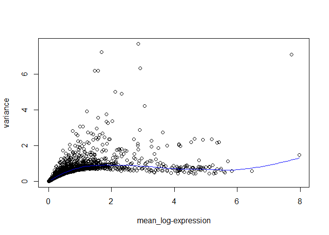<!-- -->

``` r
hvg.norm <- getTopHVGs(gene_variance, fdr.threshold = 0.05)
length(hvg.norm) 
```

    ## [1] 242

## **Create seurat object**

For downstream analysis, we create Seurat object containing raw and
normalized gene-by-cell count matrices. Column data (cell information)
is preserved. Normalized data is scaled and principal components (PCs)
are calculated by a gene-by-cell matrix with HVGs.

``` r
library(Seurat)

seurat <- as.Seurat(sce.norm,
                    counts = "counts",
                    data = "logcounts")
VariableFeatures(seurat) <- hvg.norm
```

## **Dimensionality reduction**

Normalized data is scaled and principal components (PCs) are calculated
by a gene-by-cell matrix with HVGs.

``` r
ElbowPlot(seurat, ndims = 50)
```

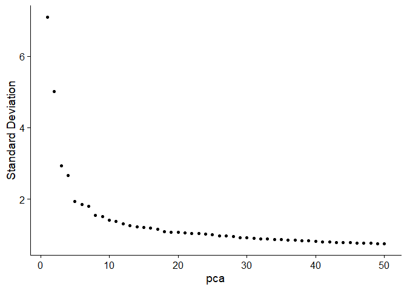<!-- -->

We set to 15 PCs for clustering and visualization. After clustering and
visualization, cells are plotted in the two-dimensional TSNE or UMAP
plot and cell information can be also shown.

``` r
PCs <- 15

seurat <- FindNeighbors(seurat,
                        dims = 1:PCs)
seurat <- FindClusters(seurat,
                       resolution = 0.2)
```

    ## Modularity Optimizer version 1.3.0 by Ludo Waltman and Nees Jan van Eck
    ## 
    ## Number of nodes: 14066
    ## Number of edges: 483138
    ## 
    ## Running Louvain algorithm...
    ## Maximum modularity in 10 random starts: 0.9499
    ## Number of communities: 10
    ## Elapsed time: 1 seconds

``` r
seurat <- RunUMAP(seurat, dims = 1:PCs)
seurat <- RunTSNE(seurat, dims = 1:PCs)
```

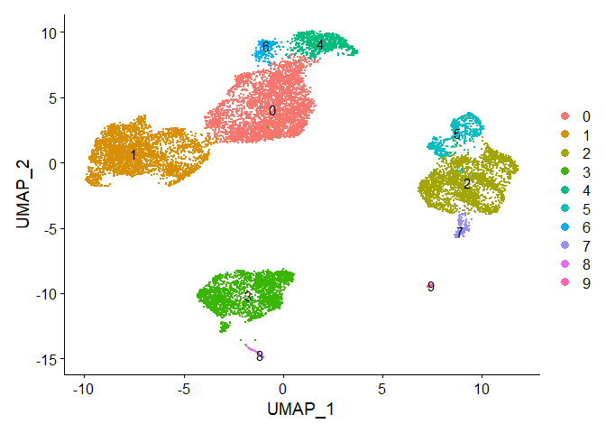<!-- -->

## **Canonical cell type marker gene expression**

Based on ‘seurat_clusters’ after clustering, cells are grouped according
to their cell types as annotated based on known cell lineage-specific
marker genes

``` r
marker.genes<- list(T.cell = c('CD3D','CD3E','TRAC'),
                    Monocyte = c('CD14','S100A8','FCGR3A'),
                    NK.cell = c('NCAM1','NKG7','TRDC'),
                    B.cell = c('CD79A','CD83','MS4A1'),
                    Classical.Dendritic = c('CLEC9A','FCER1A','CLEC10A'),
                    Plasmacytoid.Dendritic = c('CLEC4C','IL3RA','LILRA4'),
                    Plasma.cell = c('JCHAIN','TNFRSF17','SDC1'))
```

### T.cell

``` r
FeaturePlot(seurat, features = marker.genes$T.cell, order = T, ncol = 3)
```

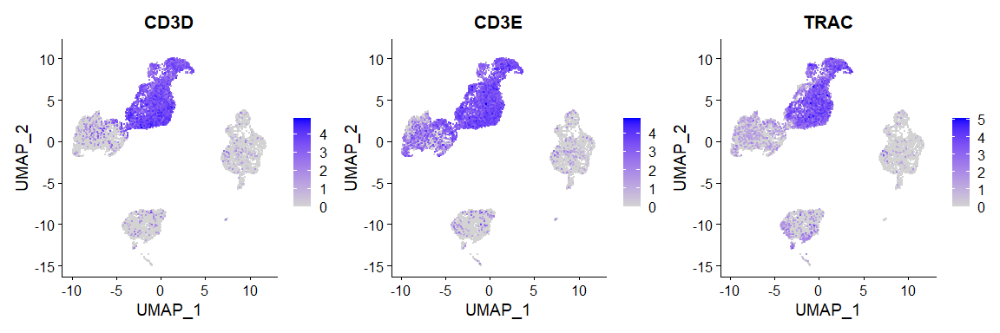<!-- -->

### Monocyte

``` r
FeaturePlot(seurat, features = marker.genes$Monocyte, order = T, ncol = 3)
```

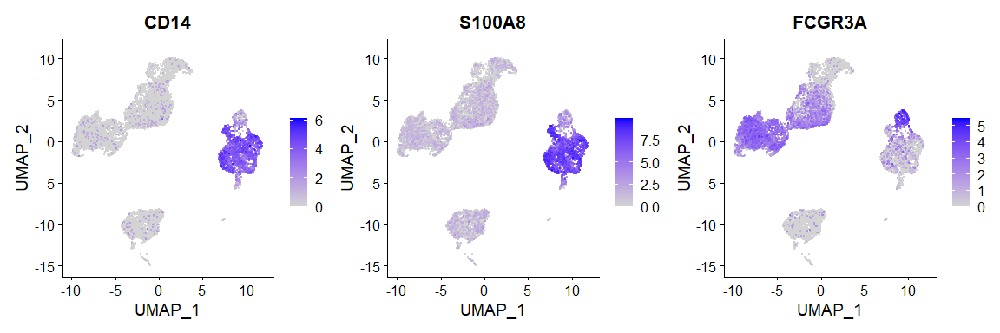<!-- -->

### NK.cell

``` r
FeaturePlot(seurat, features = marker.genes$NK.cell, order = T, ncol = 3)
```

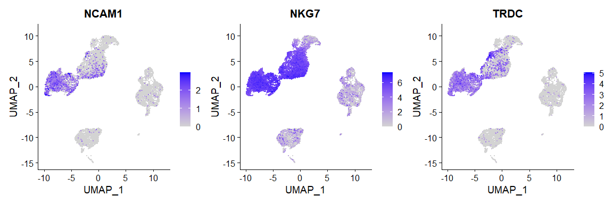<!-- -->

### B.cell

``` r
FeaturePlot(seurat, features = marker.genes$B.cell, order = T, ncol = 3)
```

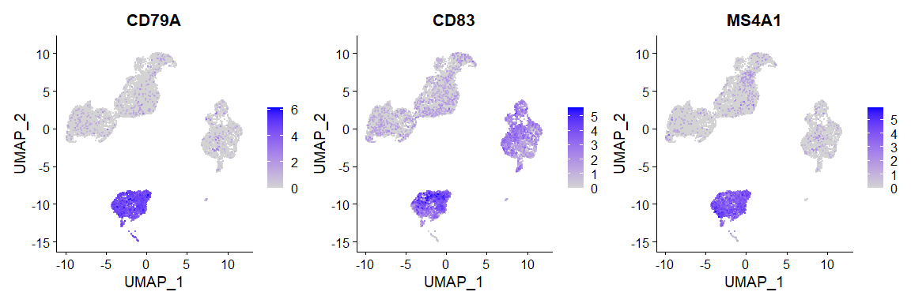<!-- -->

### Classical.Dendritic

``` r
FeaturePlot(seurat, features = marker.genes$Classical.Dendritic, order = T, ncol = 3)
```

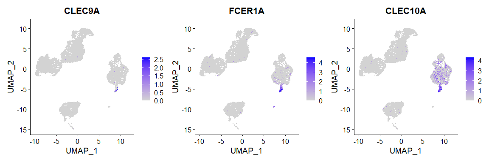<!-- -->

### Plasmacytoid.Dendritic

``` r
FeaturePlot(seurat, features = marker.genes$Plasmacytoid.Dendritic, order = T, ncol = 3)
```

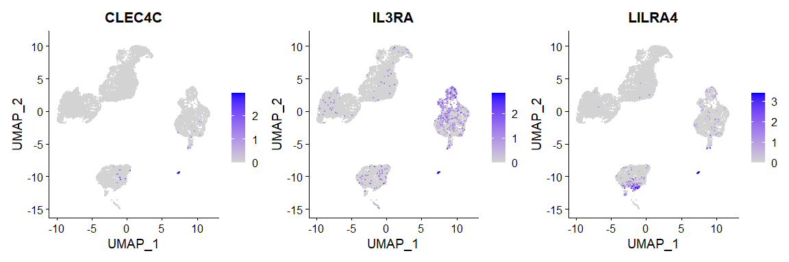<!-- -->

### Plasma.cell

``` r
FeaturePlot(seurat, features = marker.genes$Plasma.cell, order = T, ncol = 3)
```

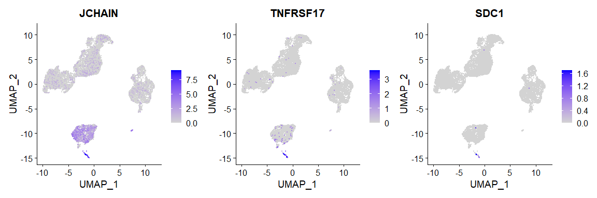<!-- -->

## Marker gene expression on Heatmap

``` r
library(pheatmap)
library(RColorBrewer)

avgExprs <- AverageExpression(seurat,
                              features = unlist(marker.genes),
                              assays = "originalexp", slot = "data")

scaledExprs <- t(scale(t(avgExprs$originalexp)))
scaledExprs[scaledExprs > -min(scaledExprs)] <- -min(scaledExprs)

palette_length = 100
my_color = my_color <- colorRampPalette(rev(brewer.pal(11, "RdBu")))(palette_length)

my_breaks <- c(seq(min(scaledExprs), 0,
                   length.out=ceiling(palette_length/2) + 1),
               seq(max(scaledExprs)/palette_length,
                   max(scaledExprs),
                   length.out=floor(palette_length/2)))

pheatmap(scaledExprs,
         cluster_cols = T, cluster_rows = F, clustering_method = "ward.D2",
         treeheight_col = 0,
         breaks = my_breaks, color=my_color,
         labels_row = as.expression(lapply(rownames(scaledExprs), function(a) bquote(italic(.(a))))),
         angle_col = 315)
```

<!-- -->

## **Cell type annotation**

``` r
seurat$celltype = as.character(seurat$seurat_clusters)

seurat$celltype[seurat$celltype %in% c('1')] <- 'NK.cell'
seurat$celltype[seurat$celltype %in% c('0','4','6')] <- 'T.cell'
seurat$celltype[seurat$celltype %in% c('3')] <- 'B.cell'
seurat$celltype[seurat$celltype %in% c('8')] <- 'Plasma.cell'
seurat$celltype[seurat$celltype %in% c('2','5')] <- 'Monocyte'
seurat$celltype[seurat$celltype %in% c('7')] <- 'Classical.Dendritic'
seurat$celltype[seurat$celltype %in% c('9')] <- 'Plasmacytoid.Dendritic'
```

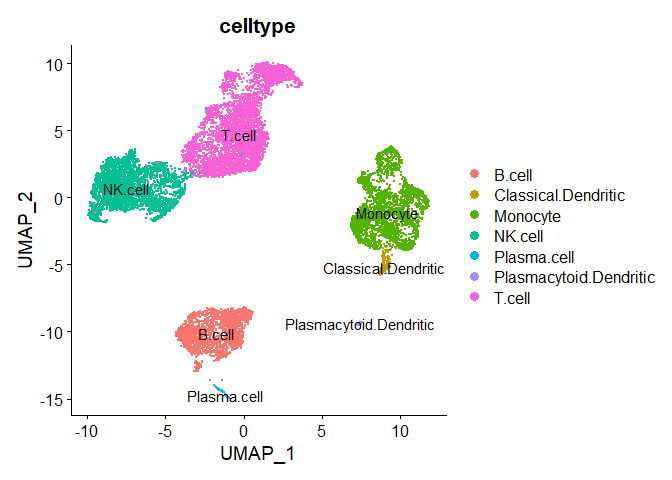<!-- -->

## **Reference**

Pekayvaz, K., Leunig, A., Kaiser, R. et al. Protective immune
trajectories in early viral containment of non-pneumonic SARS-CoV-2
infection. Nat Commun 13, 1018 (2022).

McCarthy, D. J., Campbell, K. R., Lun, A. T. & Wills, Q. F. Scater:
pre-processing, quality control, normalization and visualization of
single-cell RNA-seq data in R. Bioinformatics 33, 1179–1186 (2017)

Lun, A. T., McCarthy, D. J. & Marioni, J. C. A step-by-step workflow for
low-level analysis of single-cell RNA-seq data with Bioconductor.
F1000Res 5, 2122 (2016).

Yuhan Hao, Stephanie Hao, Erica Andersen-Nissen, William M. Mauck,
Shiwei Zheng, Andrew Butler, Maddie J. Lee, Aaron J. Wilk, Charlotte
Darby, Michael Zager, Paul Hoffman, Marlon Stoeckius, Efthymia Papalexi,
Eleni P. Mimitou, Jaison Jain, Avi Srivastava, Tim Stuart, Lamar M.
Fleming, Bertrand Yeung, Angela J. Rogers, Juliana M. McElrath,
Catherine A. Blish, Raphael Gottardo, Peter Smibert, Rahul Satija,
Integrated analysis of multimodal single-cell data,
Cell,184(13):3573-3587(2021).
