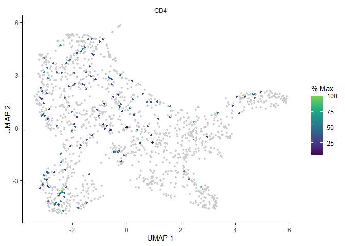

Trajectory analysis: Monocle3
================
2022-07-04

# Trajectory analysis using monocle3

``` r
library(SingleCellExperiment)
library(monocle3)
library(Seurat)
library(scran)
```

## Data loading and pre-processing

Here, we describe a brief trajectory analysis of T cell subset using
monocle3. This dataset has various celltypes including T cell.

``` r
load('./seurat.RData')
DimPlot(seurat, group.by = 'celltype',label=T)
```

<!-- -->

Since we will draw trajectory graph of T cell, extract the T cell
population from whole dataset and re-normalize.

``` r
subset <- subset(seurat, cells = colnames(seurat)[seurat$celltype == 'T cell'])
SCEset <- as.SingleCellExperiment(subset, assay = 'RNA')

clusters <- quickCluster(SCEset)
SCEset <- computeSumFactors(SCEset, clusters = clusters)
SCEset <- logNormCounts(SCEset, pseudo_count = 1)
```

Highly variable genes are also changed specifically in T cell population
and it will be used for further analysis.

``` r
dec <- modelGeneVar(SCEset)
hvg.t <- getTopHVGs(dec, fdr.threshold = 0.05)

T_cell <- as.Seurat(SCEset)
```

## Trajectory analysis

# Generate CDS object

Monocle3 package uses differently structured object named
**cell_data_set (cds)**, so normalized expressions, metadata for cells,
and metadata for genes shoud be recombined for creating cds object.

``` r
cell_metadata = T_cell@meta.data
gene_metadata = data.frame(gene_short_name = rownames(T_cell), row.names = rownames(T_cell))

cds <- new_cell_data_set(T_cell@assays$RNA@data, 
                         cell_metadata = cell_metadata, 
                         gene_metadata = gene_metadata)
```

# Dimension reduction for CDS object

monocle3 allows dimension reduction using hvgs. As we import normalized
count in cds object, we preprocess the object without additional
normalization.

``` r
cds <- preprocess_cds(cds, "PCA", num_dim = 30, norm_method = "none", use_genes = hvg.t)
monocle3::plot_pc_variance_explained(cds)
```

<!-- -->

# Correcting Batch effects

Since the dataset has various sample and batch effects, we perform
Mutual Nearest Neighbor (MNN) batch effect correction implemented
batchelor, which is included in **monocle3** package. The sample ID
information is in ‘ID’ metadata.

``` r
cds <- align_cds(cds, alignment_group = "ID") # batch correction using MNN
```

    ## Aligning cells from different batches using Batchelor.
    ## Please remember to cite:
    ##   Haghverdi L, Lun ATL, Morgan MD, Marioni JC (2018). 'Batch effects in single-cell RNA-sequencing data are corrected by matching mutual nearest neighbors.' Nat. Biotechnol., 36(5), 421-427. doi: 10.1038/nbt.4091

``` r
cds <- reduce_dimension(cds, preprocess_method = 'Aligned')
```

# Cluster cells and learn the trajectory graph

After clustering, we will fit a principal graph within each partition
using the learn_graph() function.

``` r
cds = cluster_cells(cds, resolution = 0.001)
cds = learn_graph(cds,learn_graph_control = list(prune_graph = TRUE))
```

    ##   |                                                                              |                                                                      |   0%  |                                                                              |======================================================================| 100%

    ## Warning in igraph::graph.dfs(stree_ori, root = root_cell, neimode = "all", :
    ## Argument `neimode' is deprecated; use `mode' instead

``` r
plot_cells(cds, color_cells_by = "cluster", label_cell_groups = F)
```

<!-- -->

CCR7 is known naive T cell marker, so we set the cluster where CCR7
expression is high as the root state.

``` r
plot_cells(cds, genes=c('CCR7'), show_trajectory_graph = F, cell_size = 1)
```

<!-- -->

Click the end of the branch as the root node.

``` r
cds <- order_cells(cds)
```

Plotting the cells and coloring them by pseudotime shows how they were
ordered.

``` r
plot_cells(cds,
           color_cells_by = "pseudotime",
           label_cell_groups=FALSE,
           label_leaves=FALSE,
           label_branch_points=FALSE)
```

<figure>
<figcaption aria-hidden="true">trajectory</figcaption>
</figure>

Check the gene expression of CD4 and CD8.

``` r
plot_cells(cds, genes=c('CD4'), show_trajectory_graph = F, cell_size = 1)
```

<!-- -->

``` r
plot_cells(cds, genes=c('CD8A'), show_trajectory_graph = F, cell_size = 1)
```

<!-- -->

## References

Butler, A., Hoffman, P., Smibert, P., Papalexi, E. & Satija, R. Integrating single-cell transcriptomic data across different conditions, technologies, and species. Nat. Biotechnol. 36, 411–420 (2018).

Cao, J. et al. The single-cell transcriptional landscape of mammalian organogenesis. Nature 566, 496–502 (2019).

Haghverdi L, Lun ATL, Morgan MD, Marioni JC (2018). 'Batch effects in single-cell RNA-sequencing data are corrected by matching mutual nearest neighbors.' Nat. Biotechnol., 36(5), 421-427. doi: 10.1038/nbt.4091

L. Ma, M.O. Hernandez, Y. Zhao, M. Mehta, B. Tran, M. Kelly, Z. Rae, J.M. Hernandez, J.L. Davis, S.P. Martin, D.E. Kleiner, S.M. Hewitt, K. Ylaya, B.J. Wood, T.F. Greten, X.W. Wang. Tumor cell biodiversity drives microenvironmental reprogramming in liver cancer. Canc. Cell, 36 (4): 418-430 (2019)

Lun, A. T., McCarthy, D. J. & Marioni, J. C. A step-by-step workflow for low-level analysis of single-cell RNA-seq data with Bioconductor. F1000Res 5, 2122 (2016).

McCarthy, D. J., Campbell, K. R., Lun, A. T. & Wills, Q. F. Scater: pre-processing, quality control, normalization and visualization of single-cell RNA-seq data in R. Bioinformatics 33, 1179–1186 (2017)
