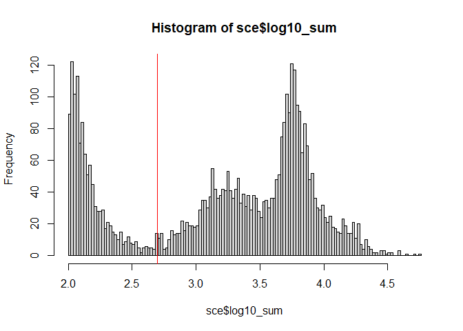
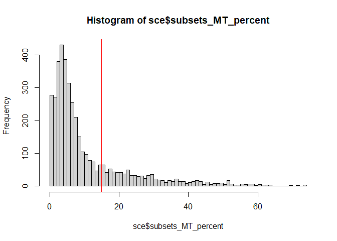
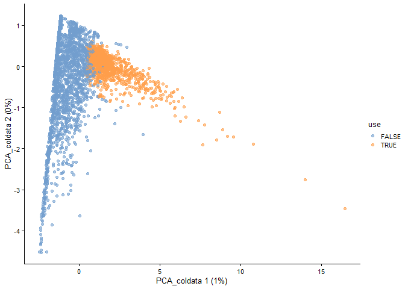

Quality Control
================
2022-07-04

# Quality Control

## Data loading

We obtained 10 SingleCellExperiment(SCE) objects without estimated
droplets from previous section. In this section, we will remove low
quality cells with large mitochondrial proportions, low RNA contents or
low detected gene numbers.

``` r
library(DropletUtils)
library(dplyr)
library(scater)
```

Loading files can be skipped if you already have SCEs in your
environment.

``` r
load(file = './PBMC_COVID_data/DropletUtils_rawsce_1.RData')
load(file = './PBMC_COVID_data/DropletUtils_rawsce_2.RData')
load(file = './PBMC_COVID_data/DropletUtils_rawsce_3.RData')
load(file = './PBMC_COVID_data/DropletUtils_rawsce_4.RData')
load(file = './PBMC_COVID_data/DropletUtils_rawsce_5.RData')
load(file = './PBMC_COVID_data/DropletUtils_rawsce_6.RData')
load(file = './PBMC_COVID_data/DropletUtils_rawsce_7.RData')
load(file = './PBMC_COVID_data/DropletUtils_rawsce_8.RData')
load(file = './PBMC_COVID_data/DropletUtils_rawsce_9.RData')
load(file = './PBMC_COVID_data/DropletUtils_rawsce_12.RData')
```

## Process one sample for example

A SCE object contains a gene-by-cell count matrix, gene data (gene
annotation, etc) and cell data (sample information, experimental
condition information, etc). Gene information will be stored in
rowData(SCE), and cell information is stored in colData(SCE). A
gene-by-cell matrix is stored as a sparse matrix in a SCE object.
Ensembl gene ids is transformed into gene symbol for eaiser further
analysis.

Since there are 10 samples, we will process one sample first and use
functions for other samples.

The structure of SCE object is like below.

``` r
sce <- DropletUtils_rawsce_5
sce
```

    ## class: SingleCellExperiment 
    ## dim: 36604 4091 
    ## metadata(1): Samples
    ## assays(1): counts
    ## rownames(36604): ENSG00000243485 ENSG00000237613 ... Htag2 Htag3
    ## rowData names(3): ID Symbol Type
    ## colnames(4091): AAACCCACATCCTAAG-1 AAACCCATCAAGCTGT-1 ...
    ##   TTTGTTGGTGGGATTG-1 TTTGTTGTCTTCGACC-1
    ## colData names(2): Sample Barcode
    ## reducedDimNames(0):
    ## mainExpName: NULL
    ## altExpNames(0):

To remove low quality cells, several values such as number of unique
molecular identifiers (UMIs) per cell, number of genes detected per
cell, the percentage of UMIs assigned to mitochondrial (MT) genes are
calculated using **addPerCellQC()** of **scater** R package.

``` r
rownames(sce) = uniquifyFeatureNames(rowData(sce)$ID, rowData(sce)$Symbol)

mtgenes = rowData(sce)[grep("^MT-", rowData(sce)$Symbol),]$Symbol
is.mito = rownames(sce) %in% mtgenes
print(table(is.mito))
```

    ## is.mito
    ## FALSE  TRUE 
    ## 36591    13

``` r
sce <- addPerCellQC(
  sce,
  subsets = list(MT=mtgenes),
  percent_top = c(50, 100, 200, 500), 
  detection_limit = 5
)

sce$log10_sum = log10(sce$sum + 1)
sce$log10_detected = log10(sce$detected + 1)

sce <- sce[,sce$sum!=0]
```

We define low-quality cells with \<500 UMIs, \>15% MT gene percents or
\<100 detected genes. Criteria is visualized as histogram below.

``` r
umi=500
mtpct=15
detect=100

hist(sce$log10_sum, breaks = 100) %>% abline(v = log10(umi), col="red")
```

<!-- -->

``` r
hist(sce$subsets_MT_percent, breaks=100) %>% abline(v=mtpct, col="red")
```

<!-- -->

``` r
hist(sce$detected, breaks = 100,ylim=c(0,500)) %>% abline(v=detect,col='red')
```

<!-- -->

Low-quality cells are filtered out and can be identified by the PCA
plot.

``` r
filter_by_total_counts = sce$sum > umi
filter_by_mt_percent = sce$subsets_MT_percent < mtpct
filter_by_nfeature = sce$detected > detect

sce <- runColDataPCA(sce, variables = list("sum", "detected", "subsets_MT_percent", "percent.top_500"))

sce$use <- (
  filter_by_total_counts &
    filter_by_mt_percent &
    filter_by_nfeature
)

plotReducedDim(sce, dimred="PCA_coldata", colour_by="use")
```

<!-- -->

``` r
sce = sce[,sce$use]
```

## Process other samples

Other samples can be processed in the same way. The same process is made
into a function below.

``` r
preprocess <- function(sce){
  rownames(sce) = uniquifyFeatureNames(rowData(sce)$ID, rowData(sce)$Symbol)
  
  mtgenes = rowData(sce)[grep("^MT-", rowData(sce)$Symbol),]$Symbol
  is.mito = rownames(sce) %in% mtgenes
  
  sce <- addPerCellQC(
    sce,
    subsets = list(MT=mtgenes),
    percent_top = c(50, 100, 200, 500), 
    detection_limit = 5
  )
  
  sce$log10_sum = log10(sce$sum + 1)
  sce$log10_detected = log10(sce$detected + 1)
  
  sce <- sce[,sce$sum!=0]
  return(sce)
}
```

``` r
filtering <- function(sce,umi,mtpct,detect){
  filter_by_total_counts = sce$sum > umi
  filter_by_mt_percent = sce$subsets_MT_percent < mtpct
  filter_by_nfeature = sce$detected > detect
  
  sce <- runColDataPCA(sce, variables = list("sum", "detected", "subsets_MT_percent", "percent.top_500"))
  
  sce$use <- (
    filter_by_total_counts &
      filter_by_mt_percent &
      filter_by_nfeature
  )
  
  plotReducedDim(sce, dimred="PCA_coldata", colour_by="use")
  
  sce = sce[,sce$use]
  return(sce)
}
```

## Remove low-quality cells

``` r
umi=500
mtpct=15
detect=100

sce.1 <- preprocess(DropletUtils_rawsce_1)
sce.1 <- filtering(sce.1,umi,mtpct,detect)

sce.2 <- preprocess(DropletUtils_rawsce_2)
sce.2 <- filtering(sce.2,umi,mtpct,detect)

sce.3 <- preprocess(DropletUtils_rawsce_3)
sce.3 <- filtering(sce.3,umi,mtpct,detect)

sce.4 <- preprocess(DropletUtils_rawsce_4)
sce.4 <- filtering(sce.4,umi,mtpct,detect)

sce.5 <- preprocess(DropletUtils_rawsce_5)
sce.5 <- filtering(sce.5,umi,mtpct,detect)

sce.6 <- preprocess(DropletUtils_rawsce_6)
sce.6 <- filtering(sce.6,umi,mtpct,detect)

sce.7 <- preprocess(DropletUtils_rawsce_7)
sce.7 <- filtering(sce.7,umi,mtpct,detect)

sce.8 <- preprocess(DropletUtils_rawsce_8)
sce.8 <- filtering(sce.8,umi,mtpct,detect)

sce.9 <- preprocess(DropletUtils_rawsce_9)
sce.9 <- filtering(sce.9,umi,mtpct,detect)

sce.12 <- preprocess(DropletUtils_rawsce_12)
sce.12 <- filtering(sce.12,umi,mtpct,detect)
```

## Change Cellbarcode name

Each cell has their own cellbarcode. To prevent errors due to the
presence of the same cellbarcode in other samples, the sample
information is added to the end of each cellbarcode. For example,
cellbarcode looks like below.

``` r
head(colnames(sce.1))
```

    ## [1] "AAACCCAAGGGTGAAA-1" "AAACCCATCAGTCTTT-1" "AAACGAAGTGCGGATA-1"
    ## [4] "AAACGAATCGTAACTG-1" "AAACGCTGTCTCACGG-1" "AAAGGATTCGTGTCAA-1"

``` r
colnames(sce.1) <- paste0(substring(colnames(sce.1),1,16),"-L1")
colnames(sce.2) <- paste0(substring(colnames(sce.2),1,16),"-L2")
colnames(sce.3) <- paste0(substring(colnames(sce.3),1,16),"-L3")
colnames(sce.4) <- paste0(substring(colnames(sce.4),1,16),"-L4")
colnames(sce.5) <- paste0(substring(colnames(sce.5),1,16),"-L5")
colnames(sce.6) <- paste0(substring(colnames(sce.6),1,16),"-L6")
colnames(sce.7) <- paste0(substring(colnames(sce.7),1,16),"-L7")
colnames(sce.8) <- paste0(substring(colnames(sce.8),1,16),"-L8")
colnames(sce.9) <- paste0(substring(colnames(sce.9),1,16),"-L9")
colnames(sce.12) <- paste0(substring(colnames(sce.12),1,16),"-L12")
```

After changing cellbarcode, it looks like below.

``` r
head(colnames(sce.1))
```

    ## [1] "AAACCCAAGGGTGAAA-L1" "AAACCCATCAGTCTTT-L1" "AAACGAAGTGCGGATA-L1"
    ## [4] "AAACGAATCGTAACTG-L1" "AAACGCTGTCTCACGG-L1" "AAAGGATTCGTGTCAA-L1"

## Sample Information

For further analysis, combine all SCE objects and give sample
informations (if the sample comes from CONTROL, ASYMPTOMATIC or
SYMPTOMATIC condition)

``` r
sce <- cbind(sce.1, sce.2, sce.3, sce.4, sce.5, sce.6, sce.7, sce.8, sce.9, sce.12)
sce$library <-'NA'
sce$library[grep('20094_0001_A_B',sce$Sample)] <- 'L1'
sce$library[grep('20094_0002_A_B',sce$Sample)] <- 'L2'
sce$library[grep('20094_0003_A_B',sce$Sample)] <- 'L3'
sce$library[grep('20094_0004_A_B',sce$Sample)] <- 'L4'
sce$library[grep('20094_0005_A_B',sce$Sample)] <- 'L5'
sce$library[grep('20094_0006_A_B',sce$Sample)] <- 'L6'
sce$library[grep('20094_0007_A_B',sce$Sample)] <- 'L7'
sce$library[grep('20094_0008_A_B',sce$Sample)] <- 'L8'
sce$library[grep('20094_0009_A_B',sce$Sample)] <- 'L9'
sce$library[grep('20094_0012_A_B',sce$Sample)] <- 'L12'
table(sce$library)
```

    ## 
    ##   L1  L12   L2   L3   L4   L5   L6   L7   L8   L9 
    ## 1823 3293 2166 1835  833 1350  324  419 1345  678

``` r
sce$Condition <- 'SYMPTOMATIC'
sce$Condition[sce$library == 'L12'] <- 'CONTROL'
sce$Condition[sce$library %in% c('L4','L5','L6')] <- 'ASYMPTOMATIC'
table(sce$Condition)
```

    ## 
    ## ASYMPTOMATIC      CONTROL  SYMPTOMATIC 
    ##         2507         3293         8266

## References
Butler, A., Hoffman, P., Smibert, P., Papalexi, E. & Satija, R. Integrating single-cell transcriptomic data across different conditions, technologies, and species. Nat. Biotechnol. 36, 411–420 (2018).

McCarthy, D. J., Campbell, K. R., Lun, A. T. & Wills, Q. F. Scater: pre-processing, quality control, normalization and visualization of single-cell RNA-seq data in R. Bioinformatics 33, 1179–1186 (2017).

Pekayvaz, K., Leunig, A., Kaiser, R. et al. Protective immune trajectories in early viral containment of non-pneumonic SARS-CoV-2 infection. Nat Commun 13, 1018 (2022).
